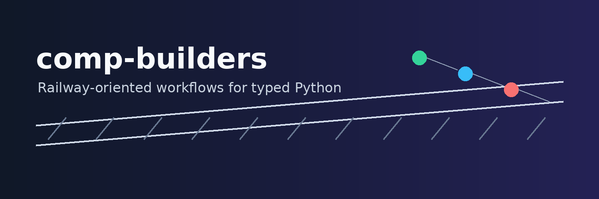
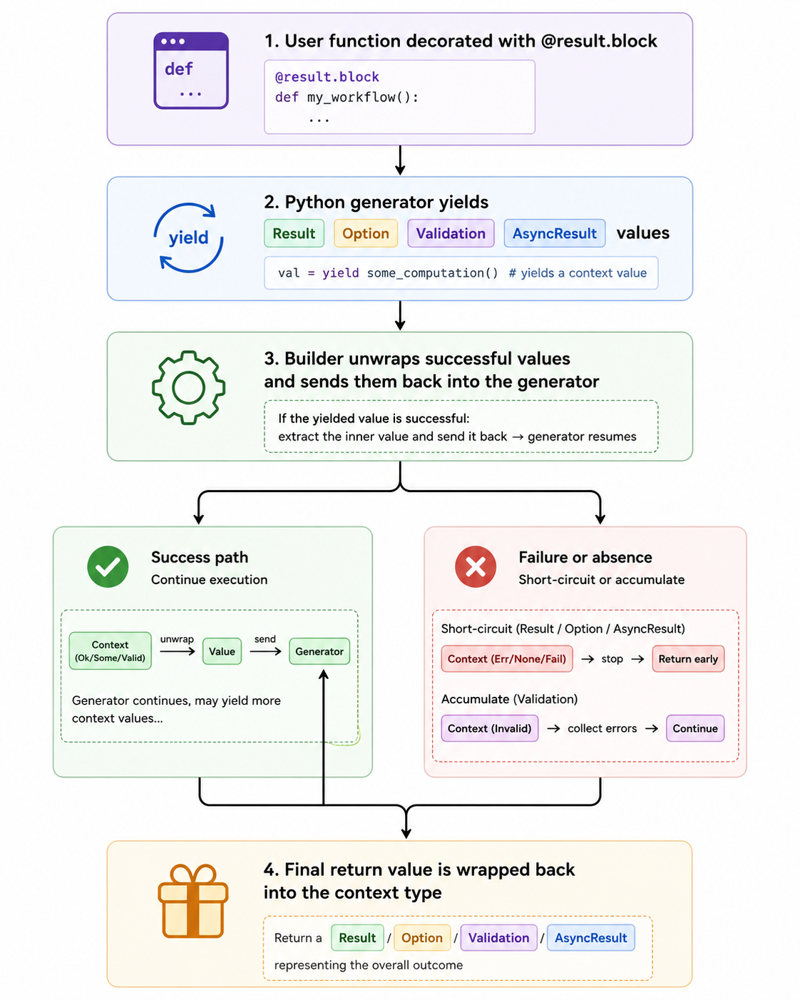

# Pythonic Computaional Expresison Builders

## `comp-builders`



`comp-builders` brings railway-oriented programming patterns to typed Python through small, dependency-free computation builders. It lets you write readable workflows that sequence `Result`, `Option`, `AsyncResult`, and `Validation` values without deeply nested `if` statements or exception-heavy control flow.

---

## Why this project exists

Many production Python workflows have the same shape: parse input, validate it, call a service, transform a response, and stop early when something goes wrong. Traditional Python handles that with exceptions, sentinel values, or repeated conditional checks. Those techniques work, but they can hide failure paths and make the happy path harder to read.

Railway-oriented programming makes success and failure explicit. A workflow moves along a success track until a step returns a failure, absence, or validation error. `comp-builders` keeps that idea lightweight and Pythonic by using generator-based blocks rather than introducing a large functional programming framework.

---

## Key features

- `Result`, `Ok`, and `Err` for computations that can succeed or fail.
- `Option`, `Some`, and `Nothing` for optional values without `None` checks scattered through a workflow.
- `AsyncResult` for awaitable operations that return explicit success or failure values.
- `Validation`, `Valid`, and `Invalid` for accumulating independent validation errors.
- Decorator-based builders: `@result.block`, `@option.block`, `@async_result.block`, and `@validation.block`.
- Typed public API with `py.typed`, runtime tests, and mypy coverage.
- No runtime dependencies.

---

## Railway-oriented programming in one minute

In functional languages, railway-oriented programming is often built from `Result`/`Either` types and bind operators:

```fsharp
let createUser raw =
  raw
  |> parseJson
  |> Result.bind readUserId
  |> Result.bind saveUser
```

A traditional Python version often repeats branching logic after every step:

```python
def create_user(raw: str):
  parsed = parse_json(raw)
  if not parsed.ok:
    return parsed

  user_id = read_user_id(parsed.value)
  if not user_id.ok:
    return user_id

  return save_user(user_id.value)
```

With `comp-builders`, each `yield` unwraps an `Ok` value or short-circuits on `Err`:

```python
from comp_builders import Err, Ok, Result, result


def parse_user_id(raw: str) -> Result[str, str]:
  value = raw.strip()
  return Ok(value) if value else Err("missing user id")


@result.block
def create_user_id(raw: str):
  user_id = yield parse_user_id(raw)
  return user_id.upper()


assert create_user_id(" ada ") == Ok("ADA")
assert create_user_id(" ") == Err("missing user id")
```

For a longer explanation with functional-language comparisons, traditional Python examples, and package-based Python examples, see [Railway-Oriented Programming for Python Users](docs/railway-oriented-programming.md).

---

## How it works



The core abstraction is `Builder.block`. Concrete builders define how yielded values are unwrapped and how final values are wrapped. For example, `ResultBuilder` unwraps `Ok(value)`, stops on `Err(error)`, and wraps a completed return value as `Ok(value)`.

---

## Install

```bash
uv add git+https://github.com/SaehwanPark/comp-builders.git
```

For local development from this repository:

```bash
uv sync --all-groups
uv run pytest
uv run mypy .
uv run ruff check .
```

## Minimal examples

### Option

```python
from comp_builders import Nothing, Some, option


@option.block
def first_initial(user: dict[str, object]):
  name = yield user.get("name", Nothing)
  return name[0]


assert first_initial({"name": Some("Ada")}) == Some("A")
assert first_initial({}) is Nothing
```

### Validation

```python
from comp_builders import Invalid, Valid, validation


@validation.block
def validate_user(data: dict[str, str]):
  name = yield Valid(data["name"]) if data.get("name") else Invalid("missing name")
  yield Valid(data["email"]) if "@" in data.get("email", "") else Invalid("invalid email")
  return name


assert validate_user({"name": "", "email": "bad"}) == Invalid(
  ("missing name", "invalid email")
)
```

---

## Documentation

- [Quickstart](QUICKSTART.md) - five-minute setup and first workflow.
- [User guide](USER_GUIDE.md) - core workflows and usage patterns.
- [API reference](API_REFERENCE.md) - public classes, functions, and builders.
- [Railway-oriented programming guide](docs/railway-oriented-programming.md) - conceptual guide with comparisons.
- [Examples](docs/examples.md) - runnable API, ETL, and ML workflow examples.
- [Architecture](ARCHITECTURE.md) - implementation notes for maintainers.
- [Changelog](CHANGELOG.md) - user-facing release history.

---

## Compatibility

`comp-builders` supports Python 3.11 and newer. It is distributed as a typed package and includes a `py.typed` marker.

---

## License

Apache License 2.0. See [LICENSE](LICENSE).
